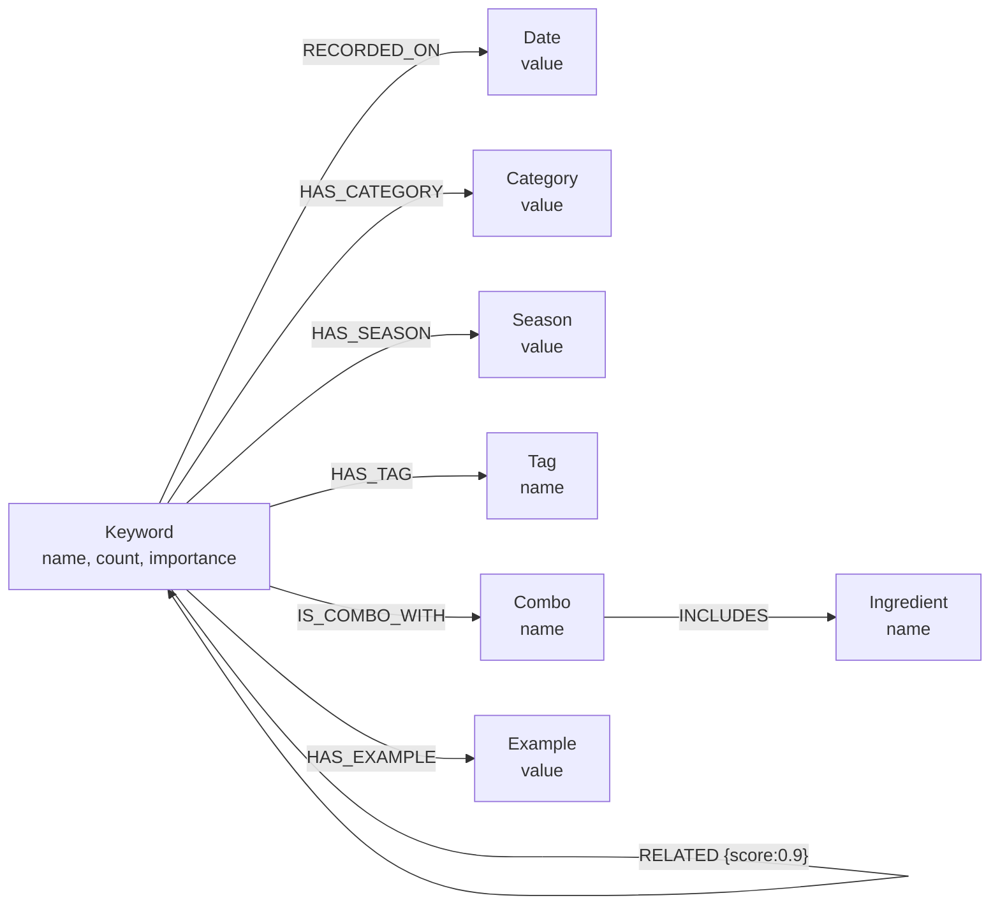

# 데이터 모델 — VCC

저장소가 넷이고 역할이 다르다.

| 저장소 | 용도 | 재적재 방식 |
|---|---|---|
| Kafka | 수집 버퍼 (`raw-youtube`) | append-only |
| **Neo4j** | 키워드 그래프 — 후보 탐색의 근거 | `MERGE` (upsert, 삭제 없음) |
| **Elasticsearch** | 서빙 검색 | 인덱스 전체 삭제 후 재생성 |
| PostgreSQL | 결과 보관 | `save_PSQL.py` |
| 파일(JSONL) | 단계 간 전달 | 날짜 폴더로 이동 (`movefile.py`) |

자세한 재적재 근거는 [ADR-0007](../adr/0007-idempotent-reload.md).

---

## 1. Neo4j 그래프 스키마



### 노드

| 라벨 | 속성 | 생성 방식 |
|---|---|---|
| `Keyword` | `name`(키), `count`, `importance` | `MERGE` + `ON CREATE SET` / `ON MATCH SET count = count + $count` |
| `Date` | `value` (YYYY-MM-DD) | 회차 구분용 |
| `Category` | `value` (예: 베이커리) | |
| `Season` | `value` | |
| `Tag` | `name` (예: 단맛, 비주얼, 트렌디) | |
| `Combo` | `name` (재료 조합명) | |
| `Ingredient` | `name` | `Combo` 를 통해서만 생성된다 |
| `Example` | `value` (예시 문장) | |

**`Keyword.count` 는 누적된다.** `ON MATCH SET k.count = coalesce(k.count, 0) + $count` 라
같은 키워드가 매주 들어오면 값이 계속 커진다. 회차별 값이 아니라 누적값이다.

`coalesce` 를 쓰는 이유가 있다. 어떤 키워드가 이전 회차에 `RELATED` 대상으로만 먼저 생기면
`count` 속성이 없다(NULL). `NULL + 숫자 = NULL` 이라 한 번 그렇게 되면 **영구히 NULL** 이고,
`count` 로 정렬하는 후보 쿼리에서 계속 뒤로 밀린다. 실제로 재현했다.

### RELATED 스텁 키워드

`related[]` 에 나온 이름은 `MERGE (b:Keyword {name: $b})` 로 노드만 생긴다 —
`count` 도 `RECORDED_ON` 도 없는 **스텁**이다.

실측(2025-05-03 데이터): Keyword 337개 중 **251개(74%)가 스텁**이었다.
`RECORDED_ON` 이 없으니 회차 단위 정리로 영원히 지울 수 없는 상태였다.

→ 스텁에도 `count = 0` 과 `RECORDED_ON` 을 달도록 고쳤다.
수정 후 `RECORDED_ON` 86 → **337**, 회차 태그 없는 Keyword 0개.

### 관계

| 관계 | 방향 | 생성됨? |
|---|---|---|
| `RECORDED_ON` | Keyword → Date | ✅ |
| `HAS_CATEGORY` | Keyword → Category | ✅ |
| `HAS_SEASON` | Keyword → Season | ✅ |
| `HAS_TAG` | Keyword → Tag | ✅ |
| `IS_COMBO_WITH` | Keyword → Combo | ✅ |
| `INCLUDES` | Combo → Ingredient | ✅ |
| `HAS_EXAMPLE` | Keyword → Example | ✅ |
| `RELATED {score: 0.9}` | Keyword → Keyword | ✅ (점수는 상수 0.9) |
| ~~`CONTAINS_INGREDIENT`~~ | Example → Ingredient | ❌ 생성 코드 없음 — **쿼리에서 제거됨** |

### `CONTAINS_INGREDIENT` — 없는 관계를 조회하던 버그 (수정됨)

재료 경로 Cypher 가 이랬다.

```cypher
MATCH (i:Ingredient)
OPTIONAL MATCH (e:Example)-[:CONTAINS_INGREDIENT]->(i)   -- 이 관계는 만들어지지 않는다
WITH i, count(e) AS usage_count
RETURN i.name AS keyword ORDER BY usage_count DESC LIMIT 10
```

`CONTAINS_INGREDIENT` 를 만드는 코드가 저장소 어디에도 없다.
`OPTIONAL MATCH` 라 에러는 나지 않고, **모든 재료의 `usage_count` 가 0** 이 되어
전부 동점이 된다. `ORDER BY` 가 무의미해져 **임의의 재료 10개**가 나갔다.

"최근 유행하는 재료"를 물었는데 후보가 무작위니 모델이 밖에서 끌어온다.
이것이 [ADR-0006](../adr/0006-llm-hallucination-candidate-restriction.md) 에서 측정한
**재료 경로 후보 밖 생성률 50%** 의 근본 원인이다. 프롬프트로는 막을 수 없는 종류였다.

**지금 쿼리** (`GragpRAG/candidates.py`) — 실재하는 관계만 쓴다.

```cypher
MATCH (i:Ingredient)<-[:INCLUDES]-(:Combo)<-[:IS_COMBO_WITH]-(k:Keyword)
OPTIONAL MATCH (k)-[:RECORDED_ON]->(d:Date)
WITH i, max(d.value) AS latest, sum(k.count) AS freq
RETURN i.name AS keyword ORDER BY latest DESC, freq DESC LIMIT $limit
```

실제 Neo4j(2025-05-03 데이터, Ingredient 98개)로 확인한 전/후:

| | 상위 5개 |
|---|---|
| 전 | 밀가루, 버터, 크림, 빵, 그릭 요거트 (`usage_count` 전부 0) |
| 후 | **딸기(209), 크림(202), 초콜릿(179), 소금(124), 생크림(112)** |

`tests/test_candidates.py` 8개가 실제 Neo4j 픽스처로 검증한다.
그중 **고아 재료 제외** 테스트가 이 회귀를 잡는다 — 깨진 쿼리로 되돌려 확인했다.

> 순위 검증만으로는 부족했다. 깨진 쿼리에서도 순위 테스트가 통과한다
> (전부 동점이라 저장 순서가 우연히 기대와 맞는다).
> 조용히 임의가 되는 버그는 순위가 아니라 **집합**으로 잡아야 한다.

### 메뉴 경로 Cypher (대조)

```cypher
MATCH (k:Keyword)
MATCH (k)-[:HAS_TAG]->(t:Tag)      -- 질문에 태그가 있을 때
WHERE t.name IN $tags
RETURN k.name, k.count ORDER BY count DESC LIMIT 10
```

이쪽은 **실재하는 관계(`HAS_TAG`, `HAS_SEASON`, `HAS_CATEGORY`)** 를 타고
`k.count` 로 정렬한다. 후보가 질문(단맛/비주얼/트렌디)과 축이 맞는다.
그래서 같은 제약 문구인데도 후보 밖 생성률이 2.2% 로 낮다.

결과가 비면 전체 상위 10개로 폴백한다.

---

## 2. Elasticsearch 인덱스

`ElasticSearch/es_indexer.py` 가 정의한다.

| 필드 | 타입 | 비고 |
|---|---|---|
| `question` | text (+ 한국어 분석) | GraphRAG 질문 |
| `recommendations` | nested/object | `[{name, description}, ...]` |
| `keywords` | **keyword** | 그때 넘긴 후보 목록 — 후보 밖 생성률 측정의 근거가 된다 |

- 문서 id: `q_{idx+1}` 고정
- 쓰기: `indices.delete` → `indices.create(MAPPINGS)` → `es.index(...)`
- 파싱 실패 시 `[FORMAT ERROR]` 를 `name` 에 넣어 **그대로 색인한다** (격리하지 않음)

`keywords` 를 같이 저장해 둔 덕분에 API 재호출 없이 후보 밖 생성률을 계산할 수 있다
(`GragpRAG/eval_grounding.py`).

---

## 3. 파일 단계 (JSONL)

단계 간 전달은 대부분 파일로 한다.

| 파일 | 생성자 | 구조 |
|---|---|---|
| `data/keywords.jsonl` | `spark/spark_keyword.py` | `{video_id, keywords[8]}` |
| `data/filtered_keywords_with_count.jsonl` | `agent/food_fillter.py` | `{keyword, count}` |
| `data/generated_keywords_with_new_count.jsonl` | `agent/keyword_combined.py` | 조합 키워드 |
| `data/neo4j_ready_keywords.jsonl` | `agent/keyword_info_collector.py` | `{keyword, category, example[], season, tag[], combo[{items[]}], related[], count, importance}` |
| `data/graphrag_answers.jsonl` | `GragpRAG/graphrag_aq.py` | `{question, answer, keywords}` |
| `data/seoul_cafe_menus.jsonl` | `spark/make_cafe_menu.py` | **합성** `{cafe_id, cafe_name, gu, menu_name, price}` |

`movefile.py` 가 회차 종료 후 `data/YYYY-MM-DD/` 로 옮긴다.
저장소에 남은 날짜 폴더(`8차`, `9ck`, `10차`, `2025-04-30`, `2025-05-03`)가 회차 기록이다.

`neo4j_ready_keywords.jsonl` 의 구조가 그대로 Neo4j 노드·관계로 매핑된다 —
`category`→`Category`, `tag[]`→`Tag`, `combo[].items[]`→`Combo`+`Ingredient`,
`example[]`→`Example`, `related[]`→`RELATED`.

---

## 4. 회차별 데이터 규모

| 회차 | 영상 | 추출 키워드(고유) | LLM 통과 | 잔존율 |
|---|---|---|---|---|
| 8차 | 575 | 852 → 후보 322 | 49 | 15.2% |
| 2025-04-30 | 350 | — | 53 | — |
| 2025-05-03 | 1,105 | — | 86 | — |

**회차마다 산출 필드가 다르다.** Neo4j 에 적재해 보면 드러난다.

| 회차 | `tag` | `combo` | `related` | `importance` | 적재 결과 |
|---|---|---|---|---|---|
| 8차 (48행) | ❌ | ❌ | ❌ | ❌ | `Tag`·`Combo`·`Ingredient` 노드가 **하나도 안 생긴다** |
| 2025-05-03 (86행) | ✅ | ✅ | ✅ | ✅ | 전체 그래프 생성 (Ingredient 98, Combo 108, Tag 40) |

8차 데이터로 적재하면 **재료 경로가 후보를 하나도 못 찾는다.**
`keyword_info_collector.py` 의 산출 스키마가 회차 사이에 바뀐 것으로 보인다.
후보가 비면 LLM 이 제약 없이 생성하므로 폴백을 넣어 뒀다.

"후보 322"는 Okt 명사+2~3gram 추출과 금칙어 필터를 거친 뒤의 `phrase_counter` 크기다.
`food_fillter.py` 는 여기서 상위 500 을 자르는데 풀이 322 라 전부 통과한다.
**분모는 322 이지 영상 수 575 가 아니다.**

수집 규모가 회차마다 달라 TF-IDF 의 IDF 가 통째로 바뀐다 —
재현성 절([README](../../README.md#재현성--어디까지-보장되는가)) 참조.
