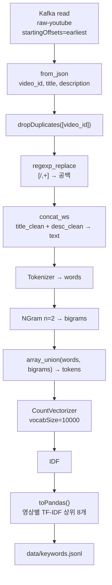
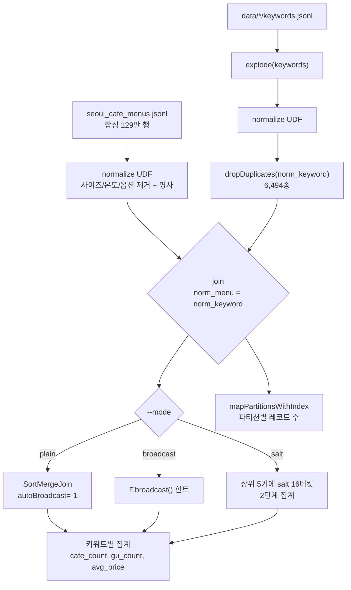

# Spark 내부 구조 — VCC

Spark 잡이 둘이다. **`spark_keyword.py`**(프로젝트 당시, TF-IDF 키워드 추출)와
**`menu_join.py`**(이후 신규, 키워드×메뉴 조인 + 스큐 실험)다.

---

## 1. `spark/spark_keyword.py` — TF-IDF 키워드 추출

파이프라인 ②단계. Kafka 에서 유튜브 제목·설명문을 읽어 영상별 키워드 8개를 뽑는다.



### 단계별 구현

| 단계 | 구현 | 비고 |
|---|---|---|
| 소스 | `spark.read.format("kafka")`, `startingOffsets=earliest` | **배치 read** (스트리밍 아님) |
| 중복 제거 | `dropDuplicates(["video_id"])` | 같은 영상 재수집 대비 |
| 정제 | `regexp_replace("[/,+]", " ")` | 제목·설명 각각 |
| 결합 | `concat_ws(" ", title_clean, desc_clean)` | 한 문서로 |
| 토큰화 | `Tokenizer` | 공백 분리 — **형태소 분석 아님** |
| n-gram | `NGram(n=2)` | bi-gram만 |
| 어휘 | `CountVectorizer(vocabSize=10000)` | |
| 가중치 | `IDF` | |
| 추출 | `toPandas()` 후 Python 루프로 상위 8개 | |

### 설계상 짚을 점

**토큰화가 형태소 분석이 아니다.** `Tokenizer` 는 공백으로만 자른다.
한국어라 "처갓집"·"순살"·"24000원" 같은 게 그대로 토큰이 된다.
명사 추출(Okt)은 다음 단계 `food_fillter.py` 에서 한다 — Spark 안에서 하지 않은 이유는
executor 마다 JVM 형태소 분석기를 올리는 비용 때문으로 보인다.

**단어 + bi-gram 을 합집합으로 넣는다.** `array_union(words, bigrams)` 라
"초코"와 "초코 케이크"가 같은 벡터 공간에서 경쟁한다.
조합 키워드를 뽑는 것이 목적이므로 의도된 설계다.

**`toPandas()` 로 드라이버에 전부 모은다.** 영상 수가 수백~천 단위라 가능하다.
TF-IDF 벡터의 `indices`/`values` 를 Python 에서 정렬해 상위 8개를 고른다.
Spark SQL 로도 할 수 있지만 SparseVector 를 다뤄야 해서 이쪽이 짧다.
**규모가 커지면 여기가 먼저 터진다** — 드라이버 메모리 한계.

### ⚠️ 재현성 — IDF 가 배치 전체에 의존한다

IDF 는 **그 배치에 들어온 문서 전체**로 계산된다.
같은 영상이라도 그 주에 무엇이 같이 수집됐느냐에 따라 상위 8개가 달라진다.

| 비교 | 공통 영상 | 완전 일치 |
|---|---|---|
| 8차(575편) ↔ 2025-04-30(350편) | 122 | 13 (10.7%) |
| 8차 ↔ 2025-05-03(1,105편) | 315 | **0 (0.0%)** |

버그가 아니라 배치 TF-IDF 의 성질이다. 다만 이것 때문에
**"파이프라인 N회 실행 산출물 일치"는 이 구조에서 성립하지 않는다.**
`spark/verify_reproducibility.py` 가 이 둘(잡의 비결정성 vs 코퍼스 의존성)을 구분해 출력한다.

### 기타

`os.environ["PYSPARK_PYTHON"] = "python"` 이 하드코딩돼 있다.
Windows 에서는 PATH 를 못 찾아 `CreateProcess error=2` 로 죽는다
(`menu_join.py` 는 `sys.executable` 을 쓴다).

---

## 2. `spark/menu_join.py` — 키워드 × 카페 메뉴 조인 (신규)

**프로젝트 당시 코드가 아니다.** 원래 저장소에는 조인도 groupBy 도 없었다
([ADR-0008](../adr/0008-skew-not-mitigated.md), [IMPROVEMENTS.md](../../IMPROVEMENTS.md)).



### 측정을 위한 설정

| 설정 | 값 | 이유 |
|---|---|---|
| `spark.sql.adaptive.enabled` | **false** | AQE 가 스큐를 자동 완화해버리면 salting 효과가 측정되지 않는다 |
| `spark.sql.autoBroadcastJoinThreshold` | **-1** (plain 모드만) | 키워드 테이블이 작아 Spark 가 알아서 broadcast 한다. 힌트 효과를 보려면 꺼야 비교가 성립 |
| `spark.sql.shuffle.partitions` | 16 | |
| `master` | `local[*]` (16스레드) | |

### 파티션 편차 측정

`mapPartitionsWithIndex` 로 파티션별 레코드 수를 **직접 센다.**

```python
def count_partition(idx, it):
    n = 0
    for _ in it:
        n += 1
    yield (idx, n)
df.rdd.mapPartitionsWithIndex(count_partition).collect()
```

Spark UI 를 보지 않고도 `max/median` 을 수치로 남길 수 있다.

**중요**: salt 모드일 때는 **그 모드가 실제로 쓰는 키로** 재파티션한 뒤 세야 한다.
`norm_keyword` 만으로 재면 salting 을 안 한 것과 같은 숫자가 나온다.

### salting 구현

```python
salt = when(array_contains(hot_keys, norm_keyword), (rand() * buckets).cast("int")).otherwise(0)
stage1 = groupBy(norm_keyword, salt).agg(collect_set(cafe_id), count(*), ...)
stage2 = stage1.groupBy(norm_keyword).agg(size(array_distinct(flatten(collect_list(cafes)))), ...)
```

**빈도 상위 N개 키에만 salt 를 붙인다.** 전체에 붙이면 재집계 비용만 늘고 얻는 게 없다.
`countDistinct` 는 2단계로 쪼갤 수 없어 `collect_set` → `flatten` → `array_distinct` 로 처리한다.
**이 비용이 salting 이 느려진 주원인이다** (+40%).

### 결과 (129만 행, 3회 p50)

| 모드 | 조인 | 소요 | max/median |
|---|---|---|---|
| plain | SortMergeJoin | **44.44s** | 4.76 |
| broadcast | BroadcastHashJoin | 47.96s (+8%) | 4.76 |
| salt | BroadcastHashJoin | 62.03s (+40%) | **2.39** |

`explain()` 출력에서 조인 방식을 문자열로 추출해 실제로 바뀌었는지 확인한다 —
힌트를 줬는데 안 바뀌는 경우를 걸러내기 위해서다.

### UDF 배포

정규화 UDF 가 `menu_normalize` 모듈을 참조하므로
`sparkContext.addPyFile("spark/menu_normalize.py")` 로 executor 에 같이 실어야 한다.
없으면 `ModuleNotFoundError` 로 죽는다.

---

## 3. 두 잡의 대비

| | `spark_keyword.py` | `menu_join.py` |
|---|---|---|
| 시점 | 프로젝트 당시 | 이후 신규 |
| 소스 | Kafka | 파일 (JSONL) |
| ML | `CountVectorizer`, `IDF` | 없음 |
| 조인 | 없음 | 있음 (실험 대상) |
| 드라이버 수집 | `toPandas()` 전량 | `collect()` 는 집계 결과만 |
| 결정성 | 코퍼스 의존 | 입력 고정 시 결정적 |
