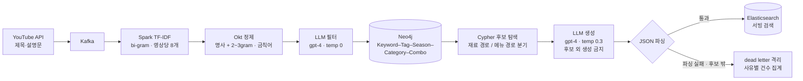

# VCC — 유튜브 기반 카페 메뉴 트렌드 분석

유튜브 영상 제목·설명문에서 메뉴 키워드를 추출하고, 태그·계절·카테고리가 연결된
후보 안에서만 신메뉴를 제안하는 파이프라인.

프로젝트 종료 후 **"후보 안에서만 생성한다"는 설계 주장이 실제로 지켜졌는지 직접 측정**했다.
결론부터: 메뉴 경로는 지켜졌고, 재료 경로는 지켜지지 않았다.

| 항목 | 값 | 측정 조건 |
|---|---|---|
| 키워드 정제 | 후보 322개 → 메뉴 49개 (잔존율 15.2%) | 8차 데이터, Okt 추출 후 |
| 정제 필터 정밀도 | **57.1%** / 재현율 77.4% | 라벨 149건, 판정자 Claude |
| └ LLM 없는 정렬 대비 | 6.1% → **57.1%** (+51.0%p) | 같은 출력 개수(49) 대조 |
| Spark 산출물 재현성 | 회차 간 완전 일치 **0~10.7%** | 배치 TF-IDF 의 코퍼스 의존성 |
| 후보 밖 생성률 — 메뉴 경로 | **2.2%** (2/92) | 저장된 답변 24건 전수 |
| 후보 밖 생성률 — 재료 경로 | **50.0%** (10/20) | 같음 |

> 후보 밖 생성률은 **lenient 기준**(생성 이름에 후보 키워드가 하나도 안 들어간 경우)이다.
> 완전 일치(strict) 기준으로는 70.5%인데, 그 대부분은 후보를 **조합한** 결과라
> 이 프로젝트의 의도(조합 생성)와 부합한다. 기준에 따라 숫자가 6배 차이 나므로 둘 다 적는다.

## 아키텍처



## 더 자세히

| 문서 | 내용 |
|---|---|
| [docs/architecture/spark.md](docs/architecture/spark.md) | TF-IDF 잡 내부, 조인/스큐 실험 구현 |
| [docs/architecture/data-model.md](docs/architecture/data-model.md) | **Neo4j 그래프 스키마**, ES 매핑, 파일 단계 |
| [docs/metrics.md](docs/metrics.md) | **SLO 와 그 목표치의 근거** — 목표를 못 세우는 항목 포함 |
| [docs/adr](docs/adr) | 설계 결정 3건 |

## 데이터 흐름

| 단계 | 처리 | 출력 | 쓰기 방식 |
|---|---|---|---|
| 수집 | YouTube API 영상 단위 | Kafka | append |
| 키워드 추출 | Tokenizer → bi-gram → CountVectorizer(10k) → IDF → 상위 8개 | 영상별 키워드 | 배치 전체 재계산 |
| 정제 | Okt 명사 + 2~3gram, 금칙어 필터 → 점수순 상위 500 컷 | 후보 322개 | 규칙 기반 |
| LLM 필터 | gpt-4 (temp 0), 50개 이내 요청 | 메뉴 49개 | — |
| 그래프 적재 | Keyword–Tag–Season–Category–Combo | Neo4j | **`MERGE` (upsert, 삭제 없음)** |
| 후보 탐색 | Cypher — "재료" 포함 여부로 분기 | 후보 10개 | — |
| 생성 | 후보만 주입 + 후보 외 생성 금지 | 조합 JSON | gpt-4, temp 0.3 |
| 검증 | JSON 파싱 + **후보 밖 여부** 확인 | 통과분 / dead letter | `grounding.validate_answer` |
| 색인 | 인덱스 삭제 후 재생성, 고정 id(`q_N`) | Elasticsearch | **전체 재적재** |

LLM은 단계마다 다르다. 재현성을 따질 때 이 표가 근거가 된다.

| 파일 | 모델 | temperature |
|---|---|---|
| `agent/food_fillter.py` | gpt-4 | 0 |
| `agent/keyword_combined.py` | gpt-4 | 0.3 |
| `agent/keyword_info_collector.py` | gpt-3.5-turbo | 0.2 |
| `GragpRAG/graphrag_aq.py` | gpt-4 | 0.3 |

## 문제 정의

영상 텍스트에는 메뉴가 아닌 콘텐츠성 단어("먹방", "리뷰", "도전")가 더 많다.
무엇이 실제 메뉴인지 걸러내는 것이 핵심이었고, LLM을 쓰자 원천에 없는 값이
에러 없이 색인되는 문제가 생겼다. 그래서 **프롬프트로 타이르는 대신 후보를 먼저 좁혀서**
LLM이 고를 수 있는 범위 자체를 제한했다.

## 후보 밖 생성률 — 설계 주장의 실측

`GragpRAG/graphrag_aq.py` 는 두 프롬프트 모두에 제약을 건다.

```
"❗ 주어진 키워드 외의 재료를 생성하면 안 됩니다."   (재료 질문)
"❗ 제공된 키워드 외 메뉴를 생성하지 마세요."        (메뉴 질문)
```

저장된 답변에 그때 넘긴 후보 키워드가 같이 들어 있어, API 재호출 없이 셀 수 있다.

```bash
python GragpRAG/eval_grounding.py
```

| 경로 | 답변 | 생성 항목 | 후보 밖(lenient) |
|---|---|---|---|
| 재료 경로 | 4건 | 20개 | **10개 (50.0%)** |
| 메뉴 경로 | 20건 | 92개 | 2개 (2.2%) |

**같은 제약을 걸었는데 경로에 따라 23배 차이가 난다.** 재료 경로에서 나온 후보 밖 값은
아보카도·코코넛·매실·망고·요거트·고구마, 그리고 `쿠알라룸푸르`(도시명)였다.

**원인은 프롬프트가 아니라 Cypher 버그였다.** 재료 경로는 이렇게 후보를 뽑는다.

```cypher
MATCH (i:Ingredient)
OPTIONAL MATCH (e:Example)-[:CONTAINS_INGREDIENT]->(i)
WITH i, count(e) AS usage_count
RETURN i.name ORDER BY usage_count DESC LIMIT 10
```

겉보기엔 "사용 빈도 상위 10개"인데, **`CONTAINS_INGREDIENT` 를 만드는 코드가
저장소 어디에도 없다.** `db.relationshipTypes()` 로 확인해도 그 관계는 DB 에 없다.
`OPTIONAL MATCH` 라 에러 없이 모든 재료의 `usage_count` 가 0 이 되고, 전부 동점이 된다.

동점 정렬이 어떻게 동작하는지는 재 봐야 안다 (`GragpRAG/eval_candidates.py`, 10회 실행).

| | 옛 쿼리 |
|---|---|
| 정렬 키가 서로 다른 값 | **1종** (전부 0) |
| 10회 결과 집합 | 1종 (일정) |
| 10회 결과 순서 | 1종 (일정) |

**실행마다 바뀌지는 않는다.** 저장 순서로 결정되고 그 순서는 안정적이다.
문제는 불안정이 아니라 **순위에 근거가 없다**는 것이다. 결과는 "유행하는 재료 10개"가
아니라 "저장 순서상 앞의 재료 10개"이고, 질문과 아무 관계가 없다.

> 조용히 틀리는 쪽이 더 나쁘다. 결과가 흔들렸다면 금방 눈치챘을 것이다.
> 안정적으로 엉뚱한 답을 주기 때문에 프롬프트 문제로 오인된다.

메뉴 경로는 `HAS_TAG`·`HAS_SEASON`·`HAS_CATEGORY` — **실재하는 관계**를 타고
`k.count` 로 정렬한다. 같은 제약 문구인데 23배 갈린 것은 프롬프트 차이가 아니라
**후보 쿼리가 실제로 동작하느냐**의 차이였다.

측정하지 않았으면 프롬프트를 고치고 있었을 것이다.

**수정** — 실재하는 `IS_COMBO_WITH`·`INCLUDES`·`RECORDED_ON` 만 타도록 바꿨다
(`GragpRAG/candidates.py`).

```bash
python GragpRAG/eval_candidates.py
```

측정 조건: 2025-05-03 데이터 **1회 적재**, Ingredient 98개(고아 0개), 각 쿼리 10회 실행.

| | 상위 5개 | 정렬 키 |
|---|---|---|
| 전 | 밀가루, 버터, 크림, 빵, 그릭 요거트 | 전부 0 (근거 없음) |
| 후 | **딸기(209), 크림(208), 초콜릿(183), 생크림(130), 소금(124)** | 서로 다른 값 10종 |

후보에서 빠진 것은 `밀가루`·`버터`·`과일`·`견과류`·`그릭 요거트` 5개다.
앞의 넷은 **어떤 메뉴 조합에도 등장하지 않는 일반 재료**다.

> **적재 횟수를 조건에 적어야 한다.** `Keyword.count` 가 `coalesce(count,0) + $count` 로
> 누적되므로 같은 파일을 두 번 적재하면 `freq` 가 정확히 2배가 된다 (딸기 209 → 418 실측).
> 스크립트가 `Date` 노드 수로 회차를 세서 1회가 아니면 경고한다.

`tests/test_candidates.py` 8개가 실제 Neo4j 픽스처로 검증한다.
그중 **고아 재료 제외**(집합) 테스트가 이 회귀를 잡는다. 순위 테스트는 깨진 쿼리에서도 통과한다.

상세: [ADR-0006](docs/adr/0006-llm-hallucination-candidate-restriction.md) ·
[그래프 스키마](docs/architecture/data-model.md)

## 정제 필터 정밀도 — 49개가 정말 메뉴인가

③ `food_fillter.py` 가 후보 322개 중 49개만 남긴다. 그 49개가 맞는지는 라벨이 있어야 안다.

```bash
python agent/eval_filter.py score
```

판정 기준 한 줄: **"이 문구가 카페 메뉴판에 단독 품목으로 올라갈 수 있는가?"**
(예: `딸기 케이크` → y / `초코` → n(재료) / `리얼 사운드` → n(콘텐츠성))

| | 라벨 | 결과 |
|---|---|---|
| 남긴 것 (전수 49) | 메뉴 28 / 오통과 21 | **정밀도 57.1%** (95% CI 43.3~70.0%) |
| 버린 것 (273 중 무작위 100, seed 20260921) | 오탈락 3 / 정상 제거 97 | 오탈락률 3.0% (1.0~8.5%) |
| 외삽 | 273건 중 놓친 메뉴 약 8건 (3~23) | **재현율 77.4%** (54.8~90.9%) |

**분모는 322다.** 영상 575줄도, 고유 키워드 852개도 아니다 —
Okt 명사+2~3gram 추출과 금칙어 필터를 거친 뒤 `phrase_counter` 크기가 322고,
상위 500 컷에 걸리지 않아 전부 LLM 입력이 된다. 잔존율은 8.5%가 아니라 **15.2%**.

### 57.1% 는 좋은 값인가 — LLM 없는 기준선과 대조

목표치를 내가 정하면 답이 안 된다. **LLM 을 빼 보면** 근거가 생긴다.
같은 정렬(`score_priority`)의 상위 49개를 그냥 쓰면 얼마인가? 출력 개수가 같으니 공평하다.

```bash
python agent/eval_filter.py baseline
```

| | 정밀도 |
|---|---|
| 기준선 (LLM 없이 점수 상위 49) | **6.1%** (층화 추정) |
| LLM 필터 | **57.1%** (95% CI 43.3~70.0%) |
| 차이 | **+51.0%p** |

신뢰구간 하한 43.3% 가 기준선을 한참 넘는다 — **LLM 단계는 값을 한다.**

기준선이 낮은 이유가 더 중요하다. 점수 상위는 `리얼 사운드`(24), `에어 프라이어`(18),
`리얼`(12), `사운드`(12) 처럼 **빈도만 높은 콘텐츠성 단어**로 채워진다.
빈도 정렬은 "많이 나온 말"을 고르지 "메뉴"를 고르지 않는다.

읽는 법 두 가지.

- **정밀도 57%는 오통과 21건이 대부분 "재료·맛 이름"이다.** `초코 칩`, `피넛 버터`,
  `크림 치즈`, `생 딸기`, `다크 초콜릿` — 메뉴가 아니라 메뉴의 구성요소다.
  LLM 이 "음식 관련인가"로 걸렀지 "단독 품목인가"로 거르지 않았다는 뜻이고,
  프롬프트에 판정 기준을 명시하면 줄어들 여지가 있다. 아직 시도하지 않았다.
- **재현율은 구간으로 읽어야 한다.** FN 이 100건 표본의 외삽이라 점추정 77.4%보다
  구간 54.8~90.9% 가 실제 정보량이다.

> **판정자는 Claude 다.** 사람 교차 검증이 없는 단일 LLM 판정이고,
> `eval/filter_metrics.json` 의 `annotator` 필드에 그렇게 기록돼 있다.
> 라벨 원본은 `eval/kept_49.csv`, `eval/dropped_sample.csv` 에 남아 있어 재판정이 가능하다.

## 재현성 — 어디까지 보장되는가

"같은 파이프라인을 N회 돌리면 같은 결과가 나온다"는 **이 구조에서는 주장할 수 없다.**
이유가 두 겹이다.

**① LLM 단계 3개가 비결정적이다.**

| 단계 | 모델 | temperature |
|---|---|---|
| `spark/spark_keyword.py` | — (TF-IDF) | — |
| `agent/food_fillter.py` | gpt-4 | 0 |
| `agent/keyword_combined.py` | gpt-4 | **0.3** |
| `agent/keyword_info_collector.py` | gpt-3.5-turbo | **0.2** |
| `GragpRAG/graphrag_aq.py` | gpt-4 | **0.3** |

캐시도 시드도 없다. temperature=0 인 `food_fillter.py` 조차 완전한 결정성이 보장되지는 않는다.

**② LLM 을 빼고 Spark 단계만 봐도, 같은 영상의 키워드가 회차마다 다르다.**

```bash
python spark/verify_reproducibility.py compare \
  data/8차/keywords.jsonl data/2025-05-03/keywords.jsonl
```

| 비교 | 공통 영상 | 완전 일치 |
|---|---|---|
| 8차 ↔ 2025-04-30 | 122개 | 13개 (10.7%) |
| 8차 ↔ 2025-05-03 | 315개 | **0개 (0.0%)** |

**이건 Spark 잡의 버그가 아니라 배치 TF-IDF 의 성질이다.** IDF 를 배치 전체 문서에서
계산하므로, 같은 영상이라도 그 주에 무엇이 같이 수집됐느냐에 따라 상위 8개가 달라진다.
수집 규모가 350 → 575 → 1,105 로 바뀌면 가중치가 통째로 바뀐다.

→ **"산출물 일치"는 이 파이프라인에서 적절한 재현성 지표가 아니다.**
적절한 것은 "같은 입력으로 돌렸을 때 같은 결과가 나오는가"(잡의 결정성)이고,
그건 `verify_reproducibility.py run --times N` 으로 재는데 Kafka 가 필요해 아직 못 돌렸다.

## 설계 결정

[docs/adr](docs/adr) 에 결정 시점의 근거와 기각한 대안을 남겼다.

- [ADR-0006](docs/adr/0006-llm-hallucination-candidate-restriction.md) LLM 환각 대응 — 후보 선행 제한 (부분 성공)
- [ADR-0007](docs/adr/0007-idempotent-reload.md) 저장소별 재적재 방식
- [ADR-0008](docs/adr/0008-skew-not-mitigated.md) 스큐 대응 미적용

## 별도 실험: 키워드 × 카페 메뉴 조인과 스큐 대응

**이건 프로젝트 당시 작업이 아니라 이후에 새로 만든 것이다.**
원래 저장소에는 조인도, 메뉴명 정규화도, groupBy 집계도, salting/broadcast도 없었다.

서울시 공공데이터에 메뉴명 단위 데이터셋이 없어 **합성 데이터**로 만들었다
(`spark/make_cafe_menu.py` — 합성임을 생성기와 문서 양쪽에 명시).

키워드 6,494종 × 메뉴 129만 행, AQE 비활성, 각 3회 p50:

| 방식 | 소요 | 파티션 편차(max/median) |
|---|---|---|
| plain (SortMergeJoin) | **44.44s** | 4.76 |
| broadcast | 47.96s (**+8%**) | 4.76 |
| salting (상위 5키 × 16버킷) | 62.03s (**+40%**) | **2.39** |

- broadcast 힌트는 `explain()` 상 조인 방식이 확실히 바뀌었는데도 느려졌다.
- salting 은 편차를 절반으로 줄였지만 2단계 집계 비용이 더 컸다.
- **이 규모에서 스큐는 병목이 아니었다.** 단일 노드 기준이라 클러스터에서는 다를 수 있다.

상세: [BENCHMARK.md](BENCHMARK.md) / [IMPROVEMENTS.md](IMPROVEMENTS.md)

## 실행 방법

### 전제조건

- **Java 9 이상** — `konlpy` 의 Okt 가 JPype 로 JVM 을 띄운다. Java 8 이면
  `RuntimeError: Java version too old` 로 죽는다. Spark 3.3 도 Java 17 을 지원하므로
  17 로 맞추면 둘 다 해결된다.
- OpenAI API 키 (`configs/.env`) — 파이프라인 ③~⑦ 단계용.
  측정 스크립트(`eval_grounding.py`, `eval_filter.py`)는 저장된 산출물만 읽으므로 키가 필요 없다.

```bash
export JAVA_HOME="/c/Program Files/Java/jdk-17"   # 경로는 환경에 맞게
python -m venv .venv && source .venv/Scripts/activate
pip install -r requirements.txt
```

### 파이프라인 (순서대로)

```bash
python kafka/youtube_crawler.py        # ① YouTube 수집 → Kafka
python spark/spark_keyword.py          # ② TF-IDF 키워드 추출 → data/keywords.jsonl
python agent/food_fillter.py           # ③ Okt 정제 + LLM 필터 → filtered_keywords_with_count.jsonl
python agent/keyword_combined.py       # ④ 조합 키워드 생성
python agent/keyword_info_collector.py # ⑤ 조합별 정보 수집 → neo4j_ready_keywords.jsonl
python neo4j/neo4j_schema.py           # ⑥ Neo4j 그래프 적재
python GragpRAG/graphrag_aq.py         # ⑦ 후보 탐색 + LLM 생성 → graphrag_answers.jsonl
python ElasticSearch/es_indexer.py     # ⑧ Elasticsearch 색인
python PostgreSQL/save_PSQL.py         # ⑨ PostgreSQL 적재
```

③~⑦ 은 OpenAI API 키가 필요하다 (`configs/.env`).
`movefile.py` 는 산출물을 날짜 폴더(`data/YYYY-MM-DD/`)로 옮긴다.

### 측정

```bash
# 후보 밖 생성률 (저장된 답변으로 계산, API 호출 없음)
python GragpRAG/eval_grounding.py

# 재료 후보 목록 전/후 (Neo4j 필요, API 호출 없음)
python GragpRAG/eval_candidates.py

# 정제 정밀도 표본 추출 → label 칸 채운 뒤 score
python agent/eval_filter.py sample
python agent/eval_filter.py score
python agent/eval_filter.py baseline    # LLM 없는 정렬과 대조

# Neo4j 정리 (회차 단위)
python neo4j/cleanup.py stats
python neo4j/cleanup.py delete-round 2025-05-03 --dry-run

# 재현성 (저장된 산출물끼리 비교 — 재실행 없음)
python spark/verify_reproducibility.py compare data/8차/keywords.jsonl data/2025-05-03/keywords.jsonl

# 조인 파이프라인 (합성 메뉴 데이터 생성 후)
python spark/make_cafe_menu.py --cafes 120000
python spark/menu_join.py --mode plain --repeat 3
```

`eval_filter.py` 는 Okt 때문에 **Java 9 이상**이 필요하다 (`JAVA_HOME` 설정).

## 남은 과제

- ~~재료 경로 후보 밖 생성률 50%~~ → 후보 Cypher 수정(`GragpRAG/candidates.py`).
  **재측정은 남았다** — OpenAI 키가 있어야 `graphrag_aq.py` 를 다시 돌려 생성률을 잰다.
- **dead letter 재처리 미구현.** 격리·집계는 구현했지만(`data/graphrag_dead_letter.jsonl`)
  자동 재시도는 없다. 현재는 다음 회차 재생성에 의존한다.
- ~~Neo4j 정리 수단 없음~~ → `neo4j/cleanup.py` 추가.
  회차 단위 삭제 + 고아 노드 정리. 전체 삭제는 `--yes` 확인이 필요하다.
- **정제 정밀도 — 라벨 판정자가 사람이 아니다.** 149건 라벨링과 계산은 끝났고
  (정밀도 57.1%, 아래 표), 라벨을 **Claude 가 단독으로** 달았다. 교차 검증이 없다.
  사람이 다시 라벨링하면 `eval_filter.py` 의 `ANNOTATOR` 를 바꾸고 `score` 를 재실행할 것.
- **재현성 — 같은 입력 재실행 미검증.** 아래 "재현성" 절 참조.
  `verify_reproducibility.py run` 은 Kafka 가 떠 있어야 해서 돌리지 못했다.
